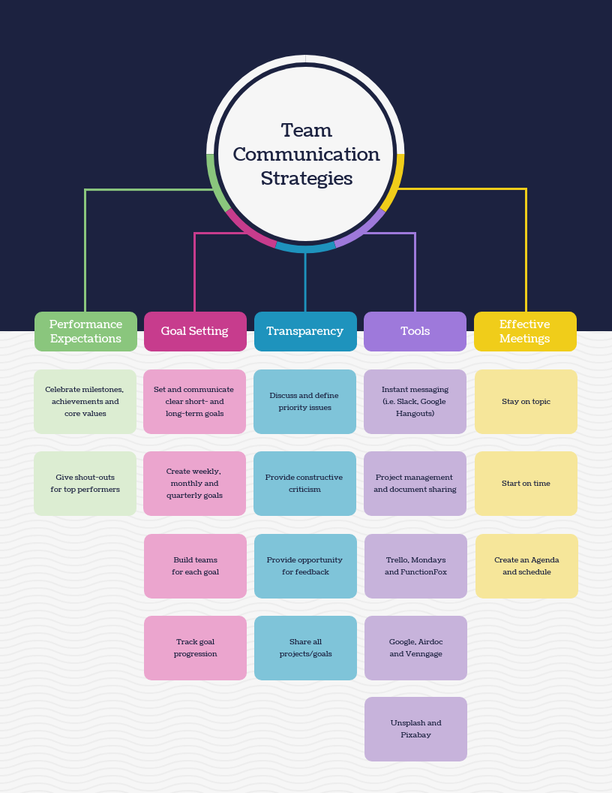
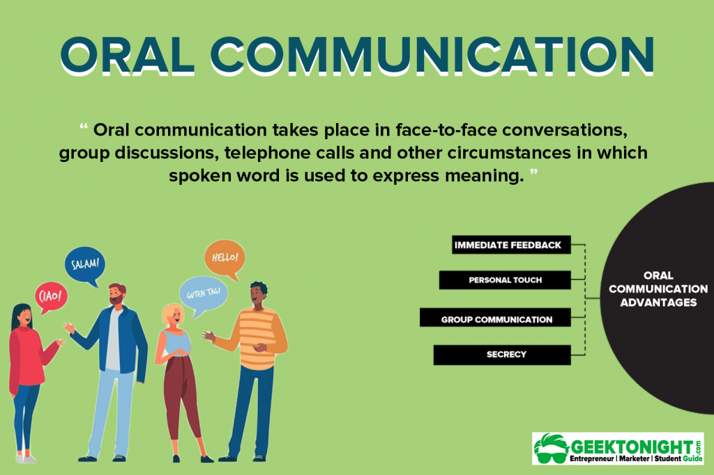
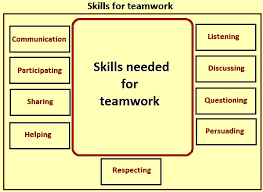
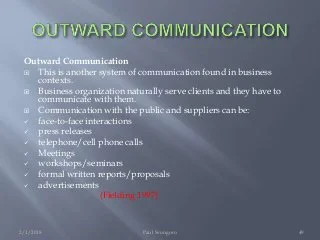

# ePortfolio
<html>
  <head>
    <body>
      <h1>Explain communication concepts and strategies</h1>
      
      <h1>show confidence and skills in oral communication and presentation</h1>
       
        <h1>work effectively as part of a team</h1>
       
        <h1>communcation effectively in a profession al context</h1>
      
        <h1>define and demonstarte conflict management and resolution strategies</h1>
    </body>
  </head>
</html>
